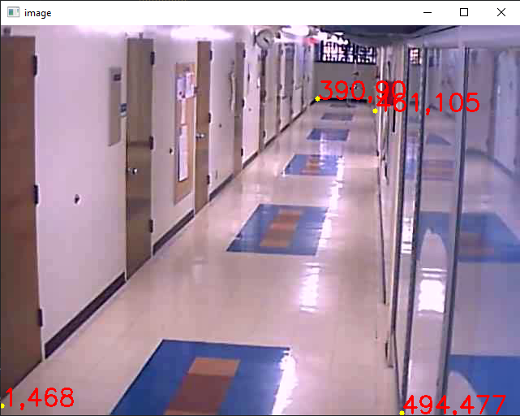

# Hallway_Corridor_Camera_Tracking
Задача: Необходимо реализовать трэкер людей с отображением пройденного пути на кадре длиной N пикселей. 
За опорную точку взять нижнюю среднюю точку bounding box.

Дополнительно: сделать отображение пути сверху, bird-eye view. Использовать для этого матрицу гомографии.
Usage example
```bash
python main.py --video_name video/004.avi --n_frames 10 --get_coord no
```


https://github.com/MaximKondakov/Hallway_Corridor_Camera_Tracking/assets/85742231/352659cb-f444-40ba-b0b7-3b1020777e5b

